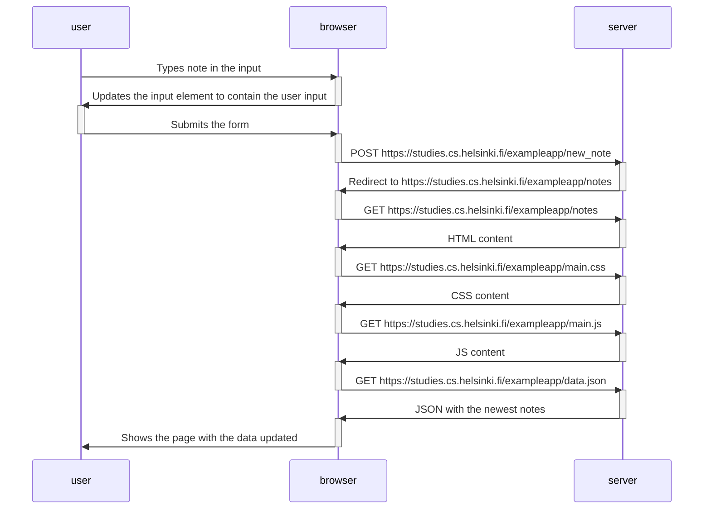

```mermaid
sequenceDiagram
    participant user
    participant browser
    participant server

    user->>browser: Types note in the input
    activate browser
    browser->>user: Updates the input element to contain the user input
    deactivate browser

    activate user
    user->>browser: Submits the form
    deactivate user

    activate browser
    browser->>server: POST https://studies.cs.helsinki.fi/exampleapp/new_note
    deactivate browser

    activate server
    server->>browser: Redirect to https://studies.cs.helsinki.fi/exampleapp/notes
    deactivate server

    activate browser
    browser->>server: GET https://studies.cs.helsinki.fi/exampleapp/notes
    deactivate browser

    activate server
    server->>browser: HTML content
    deactivate server

    activate browser
    browser->>server: GET https://studies.cs.helsinki.fi/exampleapp/main.css
    deactivate browser

    activate server
    server->>browser: CSS content
    deactivate server

    activate browser
    browser->>server: GET https://studies.cs.helsinki.fi/exampleapp/main.js
    deactivate browser

    activate server
    server->>browser: JS content
    deactivate server

    activate browser
    browser->>server: GET https://studies.cs.helsinki.fi/exampleapp/data.json
    deactivate browser

    activate server
    server->>browser: JSON with the newest notes
    deactivate server

    activate browser
    browser->>user: Shows the page with the data updated
    deactivate browser
```
