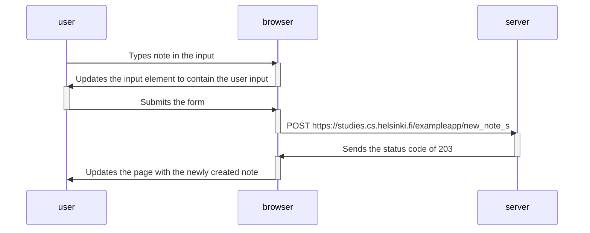

```mermaid
sequenceDiagram
    participant user
    participant browser
    participant server

    user->>browser: Types note in the input
    activate browser
    browser->>user: Updates the input element to contain the user input
    deactivate browser

    activate user
    user->>browser: Submits the form
    deactivate user

    activate browser
    browser->>server: POST https://studies.cs.helsinki.fi/exampleapp/new_note_s
    deactivate browser

    activate server
    server->>browser: Sends the status code of 203
    deactivate server

    activate browser
    browser->>user: Updates the page with the newly created note
    deactivate browser
```
